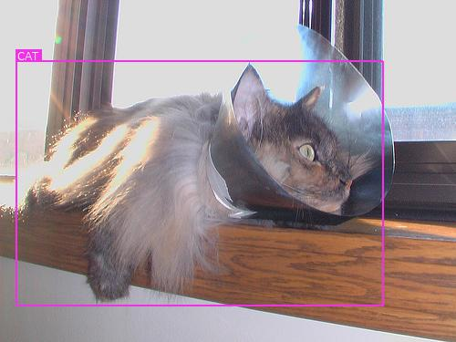
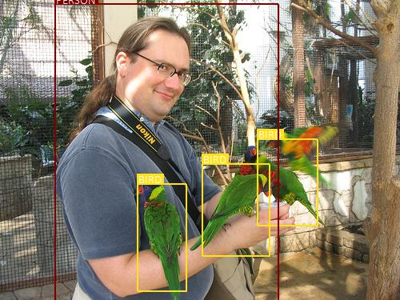

#### Download

Specfically, you will need to download the following VOC datasets –

- [2007 _trainval_](http://host.robots.ox.ac.uk/pascal/VOC/voc2007/VOCtrainval_06-Nov-2007.tar) (460MB)

```bash
mkdir data
cd data
curl -o VOCtrainval_06-Nov-2007.tar http://host.robots.ox.ac.uk/pascal/VOC/voc2007/VOCtrainval_06-Nov-2007.tar
```

- [2012 _trainval_](http://host.robots.ox.ac.uk/pascal/VOC/voc2012/VOCtrainval_11-May-2012.tar) (2GB)

```bash
curl -o VOCtrainval_11-May-2012.tar http://host.robots.ox.ac.uk/pascal/VOC/voc2012/VOCtrainval_11-May-2012.tar
```

- [2007 _test_](http://host.robots.ox.ac.uk/pascal/VOC/voc2007/VOCtest_06-Nov-2007.tar) (451MB)

```bash
curl -o VOCtest_06-Nov-2007.tar http://host.robots.ox.ac.uk/pascal/VOC/voc2007/VOCtest_06-Nov-2007.tar
```

### Data pipeline

As you know, our data is divided into _training_ and _test_ splits.


#### Parse raw data

See `create_data_lists()` in [`utils.py`](https://github.com/sgrvinod/a-PyTorch-Tutorial-to-Object-Detection/blob/master/utils.py).

#### PyTorch Dataset

See `PascalVOCDataset` in [`datasets.py`](https://github.com/sgrvinod/a-PyTorch-Tutorial-to-Object-Detection/blob/master/datasets.py).

# Training

Before you begin, make sure to save the required data files for training and evaluation. To do this, run the contents of [`create_data_lists.py`](https://github.com/sgrvinod/a-PyTorch-Tutorial-to-Object-Detection/blob/master/create_data_lists.py) after pointing it to the `VOC2007` and `VOC2012` folders in your [downloaded data](https://github.com/sgrvinod/a-PyTorch-Tutorial-to-Object-Detection#download).

```bash
python create_data_lists.py
```


See [`train.py`](https://github.com/sgrvinod/a-PyTorch-Tutorial-to-Object-Detection/blob/master/train.py).

The parameters for the model (and training it) are at the beginning of the file, so you can easily check or modify them should you need to.

To **train your model from scratch**, run this file –

`python train.py`

To **resume training at a checkpoint**, point to the corresponding file with the `checkpoint` parameter at the beginning of the code.


# Evaluation

See [`eval.py`](https://github.com/sgrvinod/a-PyTorch-Tutorial-to-Object-Detection/blob/master/eval.py).

The data-loading and checkpoint parameters for evaluating the model are at the beginning of the file, so you can easily check or modify them should you wish to.

To begin evaluation, simply run the `evaluate()` function with the data-loader and model checkpoint. **Raw predictions for each image in the test set are obtained and parsed** with the checkpoint's `detect_objects()` method, which implements [this process](https://github.com/sgrvinod/a-PyTorch-Tutorial-to-Object-Detection#processing-predictions). Evaluation has to be done at a `min_score` of `0.01`, an NMS `max_overlap` of `0.45`, and `top_k` of `200` to allow fair comparision of results with the paper and other implementations.

**Parsed predictions are evaluated against the ground truth objects.** The evaluation metric is the _Mean Average Precision (mAP)_. If you're not familiar with this metric, [here's a great explanation](https://medium.com/@jonathan_hui/map-mean-average-precision-for-object-detection-45c121a31173).

We will use `calculate_mAP()` in [`utils.py`](https://github.com/sgrvinod/a-PyTorch-Tutorial-to-Object-Detection/blob/master/utils.py) for this purpose. As is the norm, we will ignore _difficult_ detections in the mAP calculation. But nevertheless, it is important to include them from the evaluation dataset because if the model does detect an object that is considered to be _difficult_, it must not be counted as a false positive.

The model scores **77.2 mAP**, same as the result reported in the paper.

Class-wise average precisions (not scaled to 100) are listed below.

| Class | Average Precision |
| :-----: | :------: |
| _aeroplane_ | 0.7887580990791321 |
| _bicycle_ | 0.8351995348930359 |
| _bird_ | 0.7623348236083984 |
| _boat_ | 0.7218425273895264 |
| _bottle_ | 0.45978495478630066 |
| _bus_ | 0.8705356121063232 |
| _car_ | 0.8655831217765808 |
| _cat_ | 0.8828985095024109 |
| _chair_ | 0.5917483568191528 |
| _cow_ | 0.8255912661552429 |
| _diningtable_ | 0.756867527961731 |
| _dog_ | 0.856262743473053 |
| _horse_ | 0.8778411149978638 |
| _motorbike_ | 0.8316892385482788 |
| _person_ | 0.7884440422058105 |
| _pottedplant_ | 0.5071538090705872 |
| _sheep_ | 0.7936667799949646 |
| _sofa_ | 0.7998116612434387 |
| _train_ | 0.8655905723571777 |
| _tvmonitor_ | 0.7492395043373108 |

You can see that some objects, like bottles and potted plants, are considerably harder to detect than others.

# Inference

See [`detect.py`](https://github.com/sgrvinod/a-PyTorch-Tutorial-to-Object-Detection/blob/master/detect.py).

Point to the model you want to use for inference with the `checkpoint` parameter at the beginning of the code.

Then, you can use the `detect()` function to identify and visualize objects in an RGB image.

```python
img_path = '/path/to/ima.ge'
original_image = PIL.Image.open(img_path, mode='r')
original_image = original_image.convert('RGB')

detect(original_image, min_score=0.2, max_overlap=0.5, top_k=200).show()
```

This function first **preprocesses the image by resizing and normalizing its RGB channels** as required by the model. It then **obtains raw predictions from the model, which are parsed** by the `detect_objects()` method in the model. The parsed results are converted from fractional to absolute boundary coordinates, their labels are decoded with the `label_map`, and they are **visualized on the image**.

There are no one-size-fits-all values for `min_score`, `max_overlap`, and `top_k`. You may need to experiment a little to find what works best for your target data.

### Some more examples

---

<p align="center">

</p>

---

<p align="center">

</p>

---

<p align="center">

</p>

---

<p align="center">

</p>

---

<p align="center">

</p>

---

<p align="center">

</p>

---

<p align="center">

</p>

---

<p align="center">

</p>

---

<p align="center">

</p>

---

<p align="center">

</p>

---

<p align="center">

</p>

---
